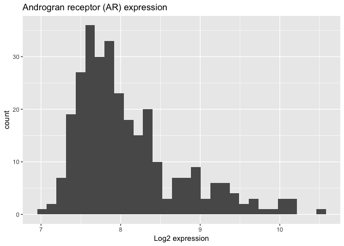
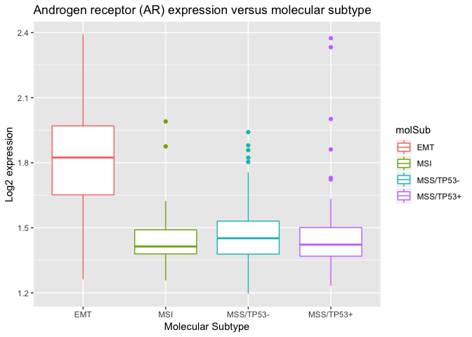

Gastric Cancer Datasets - GSE62254
================
Mik Black
26 March 2018

Load required packages

``` r
library(here)
```

    ## here() starts at /Users/black/Gastric_Cancer_Datasets

``` r
library(dplyr)
```

    ## 
    ## Attaching package: 'dplyr'

    ## The following objects are masked from 'package:stats':
    ## 
    ##     filter, lag

    ## The following objects are masked from 'package:base':
    ## 
    ##     intersect, setdiff, setequal, union

``` r
library(ggplot2)
```

    ## Registered S3 methods overwritten by 'ggplot2':
    ##   method         from 
    ##   [.quosures     rlang
    ##   c.quosures     rlang
    ##   print.quosures rlang

Set output wider (makes things look a bit nicer: topTable etc)

``` r
options(width=80)
```

Load GSE62254 Gastric Cancer data set

``` r
load(here('Data/gse62254_gastric_cancer.RData'))
```

What was loaded?

``` r
ls()
```

    ## [1] "gse62254_clinDat" "gse62254_expDat"

What sort of objects are these?

``` r
class(gse62254_clinDat)
```

    ## [1] "data.frame"

``` r
class(gse62254_expDat)
```

    ## [1] "matrix"

Dimensions

``` r
dim(gse62254_clinDat)
```

    ## [1] 300   8

``` r
dim(gse62254_expDat)
```

    ## [1] 20515   300

Variable names for clinical data set

``` r
names(gse62254_clinDat)
```

    ## [1] "dfsEvent" "dfsTime"  "lc"       "molSub"   "stage"    "region"   "gender"  
    ## [8] "ageCat"

  - dfsEvent: Disease Free Survival Event (0,1)
  - dfsTime: Time of Disease Free Survival Event (months)
  - lc: Lauren Classification
  - molSub: Molecular Subtype (Cristescu et al)
  - stage: tumour stage
  - region: anatomic region of tumour
  - gender: patient gender
  - ageCat: patient age category First few lines of the clinical data:

<!-- end list -->

``` r
head(gse62254_clinDat)
```

    ##   dfsEvent dfsTime         lc    molSub stage region gender ageCat
    ## 1       NA    3.97 Intestinal       MSI     2   body   Male  65-69
    ## 2       NA    4.03 Intestinal       MSI     2   body Female  65-69
    ## 3        0   74.97    Diffuse MSS/TP53+     2 antrum Female    <55
    ## 4        0   89.77    Diffuse       MSI     2 antrum   Male  65-69
    ## 5        0   84.60    Diffuse MSS/TP53-     3 antrum   Male  65-69
    ## 6        1    5.77      Mixed MSS/TP53-     2 antrum   Male  55-64

The sample names should be included with the clinical data, but the
samples are in the same order as in the expresion data, so we can add
those as a new variable:

``` r
gse62254_clinDat = gse62254_clinDat %>% mutate(., PatID = colnames(gse62254_expDat))
```

Now we have patients IDs in a column called PatID:

``` r
head(gse62254_clinDat)
```

    ##   dfsEvent dfsTime         lc    molSub stage region gender ageCat      PatID
    ## 1       NA    3.97 Intestinal       MSI     2   body   Male  65-69 GSM1523727
    ## 2       NA    4.03 Intestinal       MSI     2   body Female  65-69 GSM1523728
    ## 3        0   74.97    Diffuse MSS/TP53+     2 antrum Female    <55 GSM1523729
    ## 4        0   89.77    Diffuse       MSI     2 antrum   Male  65-69 GSM1523744
    ## 5        0   84.60    Diffuse MSS/TP53-     3 antrum   Male  65-69 GSM1523745
    ## 6        1    5.77      Mixed MSS/TP53-     2 antrum   Male  55-64 GSM1523746

First 5 rows and columns of the gene expression data: rows are genes
(row names are gene symbols) and columns are tumours

``` r
gse62254_expDat[1:5,1:5]
```

    ##          GSM1523727 GSM1523728 GSM1523729 GSM1523744 GSM1523745
    ## A1BG       1.628701   1.614114   1.649555   1.671960   1.636245
    ## A1BG-AS1   1.494905   1.403046   1.407533   1.514318   1.471773
    ## A1CF       1.671671   2.360347   2.589079   1.517690   2.335692
    ## A2M        2.696250   3.182516   3.254146   2.844064   3.258593
    ## A2M-AS1    1.153275   1.191874   1.297499   1.125547   1.145582

Table of Lauren Class data

``` r
table(gse62254_clinDat$lc)
```

    ## 
    ##    Diffuse Intestinal      Mixed 
    ##        142        150          8

Can “attach” clinical data to make the variables more accessible:

``` r
attach(gse62254_clinDat)
```

Now the variables can be referenced directly

``` r
table(lc)
```

    ## lc
    ##    Diffuse Intestinal      Mixed 
    ##        142        150          8

Table of Lauren Class versus Molecular Subtype

``` r
table(lc, molSub)
```

    ##             molSub
    ## lc           EMT MSI MSS/TP53- MSS/TP53+
    ##   Diffuse     38  20        46        38
    ##   Intestinal   8  43        59        40
    ##   Mixed        0   5         2         1

Extracting expression information for a single gene (e.g., Androgen
Receptor, AR).

``` r
ar_data = gse62254_expDat[rownames(gse62254_expDat) == "AR"]
```

Basic histogram of the AR data

``` r
ar_data %>% as.data.frame() %>%  
  ggplot(aes(x=.)) + 
  geom_histogram() + 
  ggtitle("Androgran receptor (AR) expression") +
  xlab("Log2 expression")
```

    ## `stat_bin()` using `bins = 30`. Pick better value with `binwidth`.

<!-- -->

Boxplot of AR expression versus Molecular Subtype

``` r
cbind(ar_data, as.factor(molSub)) %>% as.data.frame() %>%  
  ggplot(aes(x=molSub, y=ar_data, group=molSub, colour=molSub)) + 
  geom_boxplot() + 
  ggtitle("Androgen receptor (AR) expression versus molecular subtype") +
  xlab("Molecular Subtype") +
  ylab("Log2 expression")
```

<!-- -->

Differential expression analysis according to Lauren Classification.
<BR> Lauren Classification has three levels:

``` r
table(lc)
```

    ## lc
    ##    Diffuse Intestinal      Mixed 
    ##        142        150          8

Let’s get rid of the “Mixed” samples

``` r
mixed = which(lc=="Mixed")
```

These are the indexes for the mixed samples

``` r
mixed
```

    ## [1]   6  47  57  83 102 105 110 235

using the minus sign we can remove these from the Lauren data:

``` r
lc[-mixed] %>%  table()
```

    ## .
    ##    Diffuse Intestinal      Mixed 
    ##        142        150          0

Since `lc` is a factor, it still knows about the Mixed class, but it
correctly reports that there are none present. If we want to remove that
class entirely, we can convert lc to a vector:

``` r
lc[-mixed] %>%  as.vector() %>%  table()
```

    ## .
    ##    Diffuse Intestinal 
    ##        142        150

Use this for our analysis:

``` r
lc_no_mixed = lc[-mixed] %>%  as.vector()
gse62254_expDat_no_mixed = gse62254_expDat[,-mixed]
```

Set up for limma analysis

``` r
library(limma)
```

Create design matrix with Mixed samples excluded

``` r
design = model.matrix(~lc_no_mixed)
```

Check first few rows

``` r
head(design)
```

    ##   (Intercept) lc_no_mixedIntestinal
    ## 1           1                     1
    ## 2           1                     1
    ## 3           1                     0
    ## 4           1                     0
    ## 5           1                     0
    ## 6           1                     0

Second column should match table created above

``` r
table(design[,2])
```

    ## 
    ##   0   1 
    ## 142 150

Should now be able to use `lc_no_mixed` and `deisgn` to run `limma`
analysis and detect genes that are differentially expressed between the
Diffuse and Intestinal classes.
