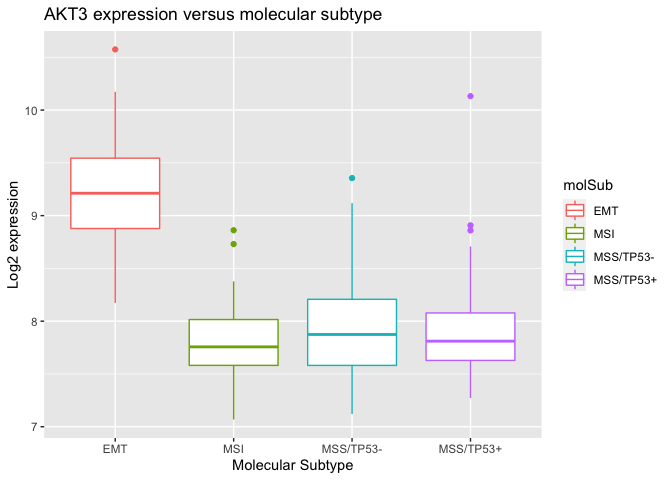

Gastric Cancer Dataset Practise - GSE62254
================
Natasha Windmeyer
19/03/2021

This Practise document is using the Affymetrix microarray dataset
(GSE62254) - re-normalised using RMA without background
    correction

``` r
install.packages('here')
```

``` r
library(here)
```

    ## here() starts at /Users/natashawindmeyer/Documents/University MSc/R Data/Gastric_Cancer_Datasets

``` r
library(dplyr)
```

    ## 
    ## Attaching package: 'dplyr'

    ## The following objects are masked from 'package:stats':
    ## 
    ##     filter, lag

    ## The following objects are masked from 'package:base':
    ## 
    ##     intersect, setdiff, setequal, union

``` r
library(ggplot2)
```

``` r
options(width=80)
```

This sets the output wider to 80, making things look a bit nicer

``` r
load(here('Data/gse62254_gastric_cancer.RData'))
```

This loads the GSE62254 Gastric Cancer Dataset

``` r
ls()
```

    ## [1] "gse62254_clinDat" "gse62254_expDat"

This confirms what was loaded

``` r
class(gse62254_clinDat)
```

    ## [1] "data.frame"

``` r
class(gse62254_expDat)
```

    ## [1] "matrix" "array"

This tells you what type of objects the datasets are

``` r
dim(gse62254_clinDat)
```

    ## [1] 300   8

``` r
dim(gse62254_expDat)
```

    ## [1] 20184   300

This gives you the dimensions of the datasets

The Variable names for the Clinical
    Dataset

``` r
names(gse62254_clinDat)
```

    ## [1] "dfsEvent" "dfsTime"  "lc"       "molSub"   "stage"    "region"   "gender"  
    ## [8] "ageCat"

dfsEvent: Disease Free Survival Event (0,1). dfsTime: Time of Disease
Free Survival Event (months). lc: Lauren Classification. molSub:
Molecular Subtype (Cristescu et al). stage: Tumour stage. region:
Anatomic region of tumour. gender: Patient gender. ageCat: Patient age
category.

``` r
head(gse62254_clinDat)
```

    ##   dfsEvent dfsTime         lc    molSub stage region gender ageCat
    ## 1       NA    3.97 Intestinal       MSI     2   body   Male  65-69
    ## 2       NA    4.03 Intestinal       MSI     2   body Female  65-69
    ## 3        0   74.97    Diffuse MSS/TP53+     2 antrum Female    <55
    ## 4        0   89.77    Diffuse       MSI     2 antrum   Male  65-69
    ## 5        0   84.60    Diffuse MSS/TP53-     3 antrum   Male  65-69
    ## 6        1    5.77      Mixed MSS/TP53-     2 antrum   Male  55-64

Gives you the first 6 lines of the clinical dataset

The sample names are not included in the clinical data, so we need to
add this as a new
column

``` r
gse62254_clinDat = gse62254_clinDat %>% mutate(, PatID = colnames(gse62254_expDat))
head(gse62254_clinDat)
```

    ##   dfsEvent dfsTime         lc    molSub stage region gender ageCat      PatID
    ## 1       NA    3.97 Intestinal       MSI     2   body   Male  65-69 GSM1523727
    ## 2       NA    4.03 Intestinal       MSI     2   body Female  65-69 GSM1523728
    ## 3        0   74.97    Diffuse MSS/TP53+     2 antrum Female    <55 GSM1523729
    ## 4        0   89.77    Diffuse       MSI     2 antrum   Male  65-69 GSM1523744
    ## 5        0   84.60    Diffuse MSS/TP53-     3 antrum   Male  65-69 GSM1523745
    ## 6        1    5.77      Mixed MSS/TP53-     2 antrum   Male  55-64 GSM1523746

We now have added the Patient IDs to a new column called PatID

``` r
gse62254_expDat[1:5,1:5]
```

    ##          GSM1523727 GSM1523728 GSM1523729 GSM1523744 GSM1523745
    ## A1BG       6.756177   6.758535   6.831012   6.797610   6.722564
    ## A1BG-AS1   6.707870   6.587865   6.573142   6.737519   6.664203
    ## A1CF       7.006766   8.283814   8.770454   6.861547   8.133696
    ## A2M        9.110612  10.660462  10.881237   9.614966  10.890116
    ## A2M-AS1    6.291446   6.409076   6.495454   6.305241   6.289737

This shows the first five rows and columns of the gene expression data,
where the rows are genes and the columns are tumours

``` r
table(gse62254_clinDat$lc)
```

    ## 
    ##    Diffuse Intestinal      Mixed 
    ##        142        150          8

This produces a table of the Lauren Classification data

``` r
attach(gse62254_clinDat)
```

This ‘attaches’ the clinical data to make it more accessible, which
means that instead of using gse62254\_clinDat$lc to access the lc data,
you can just put lc. This is a cheat and it works well for datasets with
a very long name, however, if two datasets with the ‘attach’ have the
same variable name then it gets very messy very quickly.

``` r
table(lc)
```

    ## lc
    ##    Diffuse Intestinal      Mixed 
    ##        142        150          8

This is a table of Lauren Classification produced without needing to use
gse62254\_clinDat$lc, due to the ‘attach’ function.

``` r
table(lc, molSub)
```

    ##             molSub
    ## lc           EMT MSI MSS/TP53- MSS/TP53+
    ##   Diffuse     38  20        46        38
    ##   Intestinal   8  43        59        40
    ##   Mixed        0   5         2         1

This produces a table of the Lauren Classifications vs the Molecular
Subtypes

``` r
akt3_data = gse62254_expDat[rownames(gse62254_expDat) == "AKT3"]
```

This extracts the expression information for the single AKT3 gene, and
puts it into a dataset called
akt3\_data

``` r
akt3_data %>% as.data.frame() %>% ggplot(aes(x=.)) + geom_histogram() + ggtitle("Androgran receptor (AR) expression") + xlab("Log2 expression")
```

    ## `stat_bin()` using `bins = 30`. Pick better value with `binwidth`.

<!-- -->
This produces a Histogram of the Androgan Receptor Expression Data (AKT3
data)

``` r
cbind(akt3_data, as.factor(molSub)) %>% as.data.frame() %>%
  ggplot(aes(x=molSub, y=akt3_data, group=molSub, colour=molSub)) + geom_boxplot() + ggtitle("AKT3 expression versus molecular subtype") + xlab("Molecular Subtype") + ylab("Log2 expression")
```

<!-- -->
This combines the AKT3 data and the Molecular Subtype data as a single
dataframe and then produces a boxplot of this dataframe, representing
the Log2 Expression data for the AKT3 gene across the different
Molecular subtypes.

``` r
mixed = which(lc == "Mixed")
mixed
```

    ## [1]   6  47  57  83 102 105 110 235

This pulls the Mixed column from the lc data, creating a dataframe
containing these values called ‘mixed’

``` r
lc[-mixed] %>% table()
```

    ## .
    ##    Diffuse Intestinal      Mixed 
    ##        142        150          0

This creates a table of the lc data with the ‘mixed’ data removed. As
‘lc’ is still a factor, it knows about the ‘Mixed class’, but reports
correctly that there are none present.

``` r
lc[-mixed] %>%  as.vector() %>%  table()
```

    ## .
    ##    Diffuse Intestinal 
    ##        142        150

This creates a table of the lc data with the ‘mixed’ column removed
entirely by converting the lc to a vector.

Use these for the Analysis:

``` r
lc_no_mixed = lc[-mixed] %>%  as.vector()
gse62254_expDat_no_mixed = gse62254_expDat[,-mixed]
```

``` r
library(limma)
```

``` r
design = model.matrix(~lc_no_mixed)
head(design)
```

    ##   (Intercept) lc_no_mixedIntestinal
    ## 1           1                     1
    ## 2           1                     1
    ## 3           1                     0
    ## 4           1                     0
    ## 5           1                     0
    ## 6           1                     0

This creates a design matrix with the Mixed samples excluded from the
data

``` r
table(design[,2])
```

    ## 
    ##   0   1 
    ## 142 150

The second column should match the table created above, which means that
we should now be able to use ‘lc\_no\_mixed’ and ‘design’ to run a
‘limma’ analysis and detect genes that are differentially expressed
between the Diffuse and Instestinal classes.
